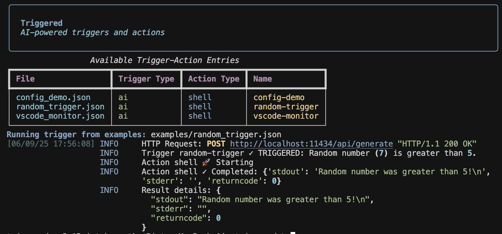

# 🚀 Triggered

**Automation at the speed of thought** – run *anything* (shell, TypeScript, AI, webhooks) in response to cron schedules, file‑system events, HTTP calls, or smart AI checks.

> Like crontab, but with **AI super‑powers** ⚡️

## ✨ Why Triggered?

* 🤖 **AI‑powered triggers** — let an LLM (plus optional Python/JS *tools*) decide *when* to fire.
* 🔔 **Any signal** — cron schedules, folder changes, incoming webhooks, or smart AI checks.
* ⚡ **Any reaction** — shell commands, TypeScript scripts (inside Docker), AI calls, outbound webhooks.
* 🖥️ **CLI & REST API** — manage everything in the terminal **or** browse `http://localhost:8000/docs`.
* 🧩 **Pluggable** — ship new triggers/actions/tools with a few lines of Python.


Triggered lets you automate tasks by linking **Triggers** to **Actions**.

  * **Triggers** watch for events.
  * **Actions** are the tasks that run when a trigger fires.

You can mix and match them to create powerful automations.

| Triggers (The "If")                                      | Actions (The "Then")                                   |
| -------------------------------------------------------- | ------------------------------------------------------ |
| 🤖 **AI** - "Is my server's CPU usage too high?"         | 🧠 **AI Call** - "Summarize this log file for me."     |
| 📂 **File System Monitor** - "Was a new file just added?" | 🐚 **Shell Command** - `echo "New file detected!"`     |
| 🌐 **Webhook** - "Did I just receive a GitHub push?"      | 📜 **TypeScript** - Run a custom script in Docker. |
| ⏰ **Time (Cron)** - "Is it 9 AM on a Monday?"            | 📞 **Webhook Call** - Send a notification to Slack.    |


<div align="center">
  
</div>

<div align="center">
  <table>
    <tr>
      <td align="center">
        
        <br/>
        <em>Interactive CLI for creating and managing triggers</em>
      </td>
      <td align="center">
        
        <br/>
        <em>Running AI triggers from CLI or via Web API</em>
      </td>
    </tr>
  </table>
</div>


## Development Setup

1. Clone the repository:
```bash
git clone https://github.com/CatchTheTornado/triggered.git
cd triggered
```

2. Create and activate a virtual environment:
```bash
python -m venv venv
source venv/bin/activate  # On Windows: venv\Scripts\activate
```

3. Install development dependencies:
```bash
pip install -e ".[dev]"
```

4. Install pre-commit hooks:
```bash
pre-commit install
```

## Quick Start

1. Create a trigger-action definition:
```bash
triggered add
```
This will start an interactive prompt to create a new trigger-action configuration.

2. List available triggers:
```bash
triggered ls
```

3. Check available components and loaded triggers:
```bash
triggered check
```
This command displays:
- Available trigger types and their descriptions
- Available action types and their descriptions
- Currently loaded trigger-action JSON files from enabled_trigger_actions and example_trigger_actions directories

4. Start the server:
```bash
triggered start
```
This will start the FastAPI server with default settings (host: 0.0.0.0, port: 8000).


**Note:** By default, all the examples from the `example_trigger_actions` will start processing - this could be a pretty messy regarding the console display :)

You can disable the examples by running the:

```bash
triggered disable ai_random_ts.json
triggered disable ai_random_webhook.json
triggered disable config_demo.json
triggered disable cron_random.json
triggered disable random_trigger.json
triggered disable tmp_file_analyzer.json
triggered disable vscode_monitor.json
triggered disable webhook_random.json
triggered disable webhook_test.json
```


You can customize the server settings:
```bash
triggered start --host localhost --port 3000
```

Enable auto-reload during development:
```bash
triggered start --reload
```

5. Run a trigger once:
```bash
triggered run random_trigger.json
```

There are some pretty cool examples included so you can test them one by one by running:

```bash
triggered run ai_random_ts.json
triggered run random_trigger.json
triggered run vscode_monitor.json
```

## Development

### Project Structure

```
triggered/
├── actions/          # Action implementations
├── triggers/         # Trigger implementations
├── core.py          # Core trigger-action logic
├── registry.py      # Component registry
├── server.py        # FastAPI server
├── cli.py           # CLI interface
└── logging_config.py # Logging configuration

enabled_trigger_actions/  # Active trigger definitions
example_trigger_actions/  # Example trigger definitions
disabled_trigger_actions/ # Disabled trigger definitions
```

### Testing

Run tests with pytest:
```bash
pytest
```


## TODO / Roadmap

- [ ] MCP support
- [ ] More examples: Slack trigger, GMail trigger ...
- [ ] Docker setup for distributed run (with Celery)
- [ ] Web API Security improvements
- [ ] Simple Web GUI for displaying the running `trigger_actions`
- [ ] Simple Web GUI for adding `trigger_actions`

## Documentation

- [Configuration and ENV](./docs/configuration.md)
- [CLI and Server commands](./docs/cli.md)
- [Available components: triggers, actions, tools](./docs/available_components.md)
- [Extending - adding custom actions and triggers](./docs/extending.md)
- [Trigger JSON format](./docs/json_format.md)
- [Adding custom AI functions/tools](./docs/ai-tools.md)
- [Web API documentation](./docs/api.md)


## Contributting

Anyone is invited! Please read the - [Extending - adding custom actions and triggers tutorial](./docs/extending.md) which is a great idea to contribute - by adding next default components to the platform.

## License

MIT License
